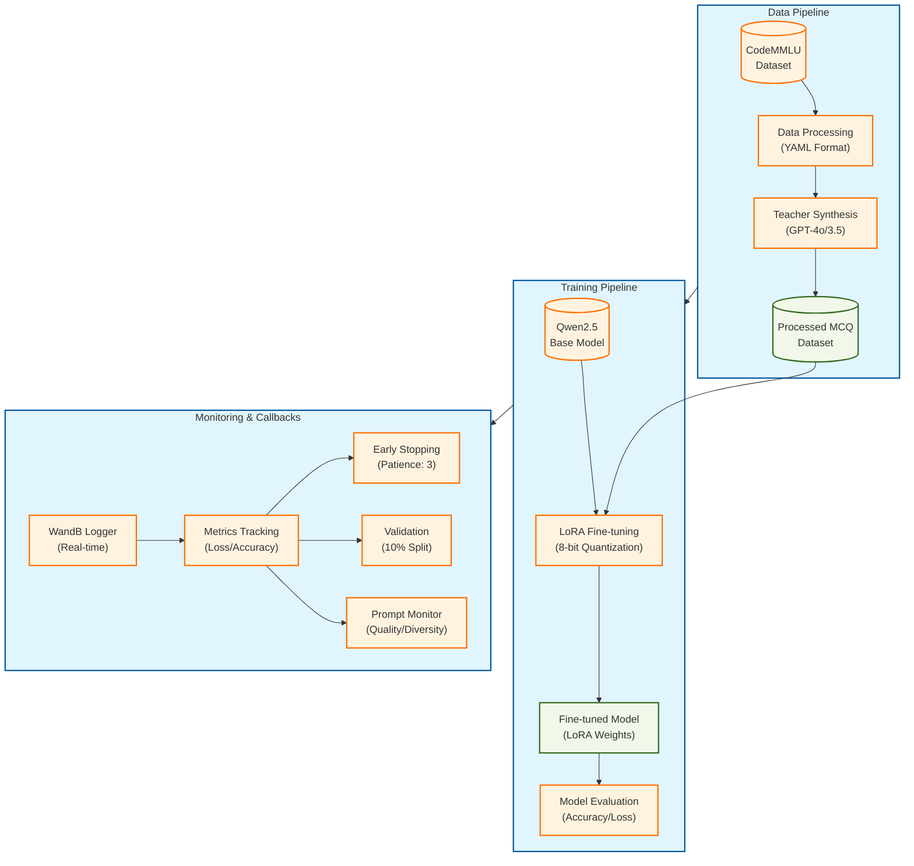
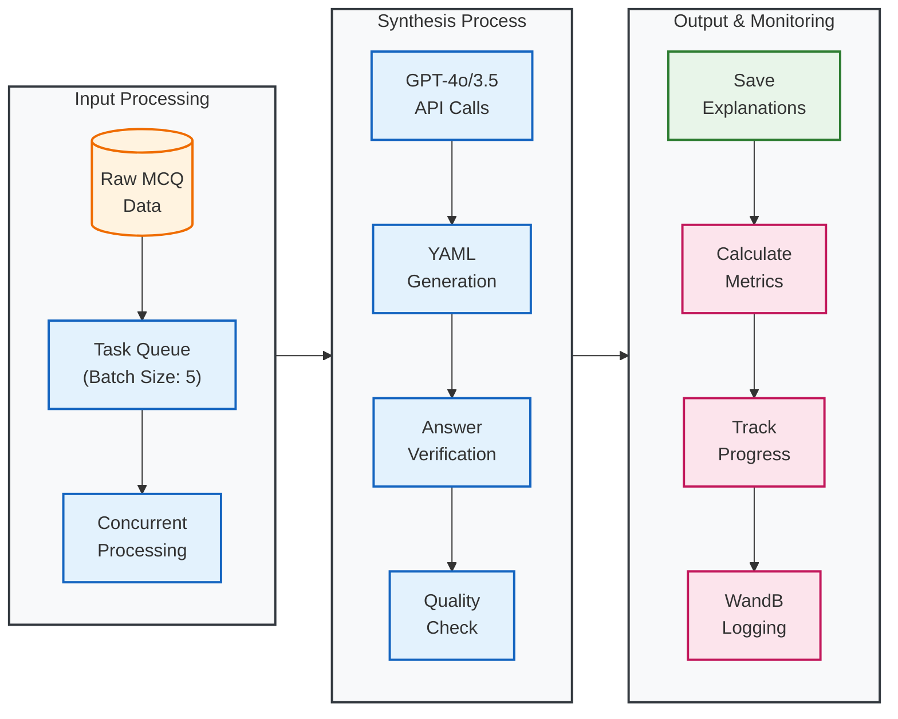
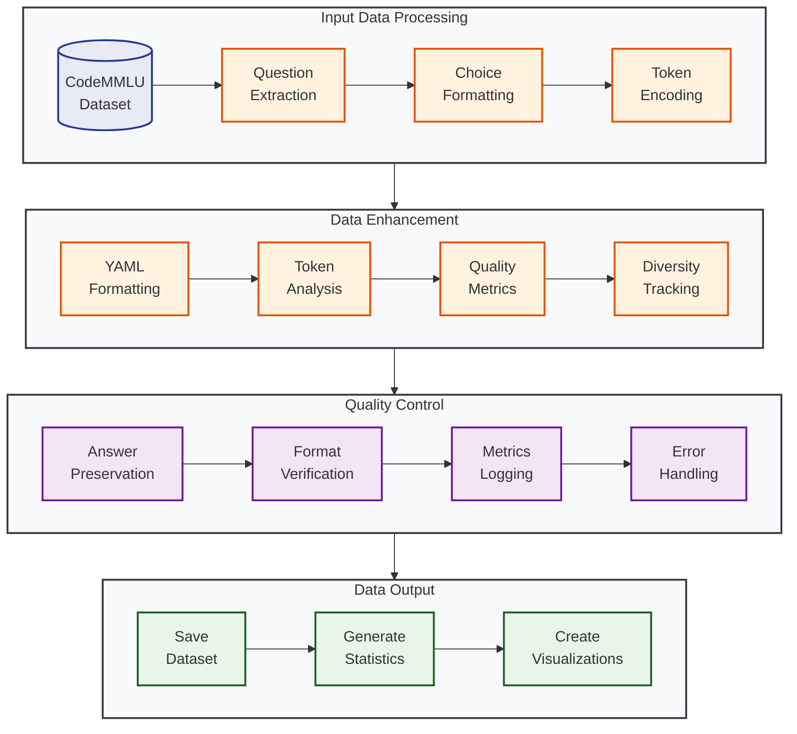
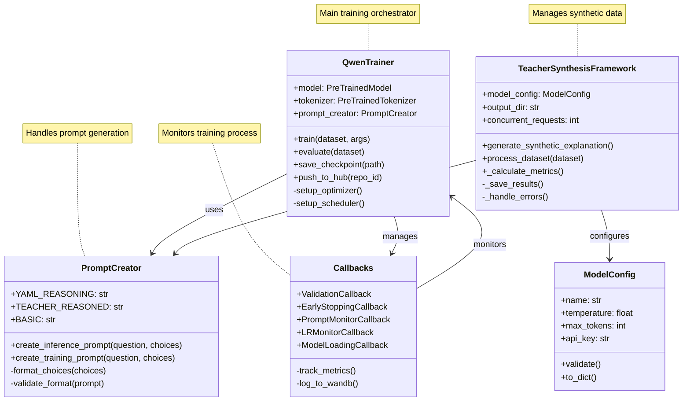
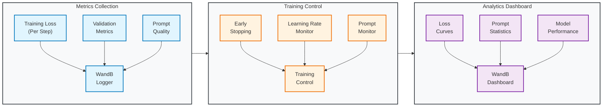

# Qwen-Coder-MCQ: Fine-tuning Qwen2.5 for Multiple-Choice Coding Questions

<div align="center">
  
  
  
  
  <!--  -->
  
  <!-- 
   -->
  <!--  -->
</div>

This project provides a framework for fine-tuning **Qwen2.5-Coder-1.5B-Instruct** models on multiple-choice coding questions with structured reasoning. It uses LoRA (Low-Rank Adaptation) for efficient training and includes a comprehensive pipeline for data processing, training, and evaluation.

> 📢 **Dataset Available**: The high-quality synthesis dataset containing 3,549 coding multiple-choice questions with detailed teacher explanations is now available on HuggingFace: [tuandunghcmut/coding-mcq-reasoning](https://huggingface.co/datasets/tuandunghcmut/coding-mcq-reasoning). Each question includes structured YAML reasoning steps generated by GPT-4o, making it ideal for training and evaluating coding question-answering models.

> 🔥 **Model Checkpoint**: The best model checkpoint from this project is now available on HuggingFace: [tuandunghcmut/Qwen25_Coder_MultipleChoice_v4](https://huggingface.co/tuandunghcmut/Qwen25_Coder_MultipleChoice_v4).

<!-- Interactive Notebook in the notebooks folder of this repository -->
> 📝 **Interactive Notebook**: Try out the model with our interactive Google Colab notebook: [](https://colab.research.google.com/github/tuandung222/Small-Qwen-Coding-Multiple-Choice/blob/main/notebooks/inference_examples.ipynb). Please refer to the directory `notebooks` for the latest version of the notebook.


## 📑 Table of Contents

- [Quick Start](#quick-start)
  - [Installation](#installation)
  - [Basic Usage](#basic-usage)
  - [Environment Setup](#environment-setup)
- [Prompt Formats](#prompt-formats)
  - [Student Reasoning Format](#student-reasoning-format)
  - [Teacher Synthesis Format](#teacher-synthesis-format)
- [Command-Line Interface](#command-line-interface)
  - [Training Arguments](#training-arguments)
  - [Synthesis Arguments](#synthesis-arguments)
  - [Monitoring Arguments](#monitoring-arguments)
- [Features](#features)
- [Dataset](#dataset)
- [Advanced Features](#advanced-features)
- [Examples and Showcase](#examples-and-showcase)
- [System Architecture](#system-architecture)
  - [Overall System Design](#overall-system-design)
  - [Training Architecture](#training-architecture)
  - [Data Processing Pipeline](#data-processing-pipeline)
  - [Monitoring System](#monitoring-system)

## 🚀 Quick Start

### Installation

1. Clone the repository:
```bash
git clone https://github.com/tuandung222/Small-Qwen-Coding-Multiple-Choice.git
cd Small-Qwen-Coding-Multiple-Choice
```

2. Install dependencies:
```bash
pip install -r requirements.txt
```

### Environment Setup

Set up environment variables in either of two ways:

1. Using a `.env` file (recommended):
```bash
# Copy the example .env file
cp .env.example .env

# Edit the .env file with your API keys
nano .env
```

Required variables in `.env`:
```
HF_TOKEN=your_huggingface_token_here
WANDB_API_KEY=your_wandb_api_key_here
OPENAI_API_KEY=your_openai_api_key_here  # Required for teacher synthesis
```

2. Using environment variables directly:
```bash
export HF_TOKEN=your_huggingface_token_here
export WANDB_API_KEY=your_wandb_api_key_here
export OPENAI_API_KEY=your_openai_api_key_here
```

### Basic Usage

1. **Training the Model**:
```bash
# Basic training
python src/run.py

# Advanced training with custom parameters
python src/run.py \
  --experiment-name "my_experiment" \
  --source-model "unsloth/Qwen2.5-Coder-1.5B-Instruct" \
  --epochs 5 \
  --batch-size 16 \
  --learning-rate 1e-4
```

### Using train.sh Script

The `train.sh` script provides a convenient way to start training with optimized default settings and proper environment configuration. Here's how to use it:

1. **Make the script executable**:
```bash
chmod +x train.sh
```

2. **Configure training parameters** (optional):
Edit the following variables in `train.sh` to customize your training:
```bash
# Model configuration
SOURCE_MODEL="unsloth/Qwen2.5-Coder-1.5B-Instruct"
DESTINATION_REPO="your-username/your-model-name"

# Training hyperparameters
BATCH_SIZE=16
GRAD_ACCUM=2
LEARNING_RATE=5e-5
EPOCHS=3
WARMUP_STEPS=20
VALIDATION_STEPS=30
DEBUG_SAMPLES=3

# Validation settings
MINIMAL_VALIDATING=true
MAX_VALIDATION_SAMPLES=90
SAVE_STEPS=60
SAVE_TOTAL_LIMIT=5
```

3. **Start training**:
```bash
./train.sh
```

The script includes several optimizations and features:
- Proper environment variable setup for stability
- Automatic PYTHONPATH configuration
- Process cleanup before starting
- Logging to `train.log`
- Lion 8-bit optimizer settings
- Flash Attention 2 integration
- Gradient checkpointing
- WandB logging integration
- Automatic model pushing to Hub

4. **Monitor training**:
```bash
# View live training logs
tail -f train.log

# Monitor GPU usage
watch -n 1 nvidia-smi
```

2. **Generating Synthetic Explanations**:
```bash
# Basic synthesis
python src/data_synthesis/gpt4o_generated.py \
  --model gpt-4o \
  --data-path /path/to/dataset

# Advanced synthesis with options
python src/data_synthesis/gpt4o_generated.py \
  --model gpt-4o \
  --data-path /path/to/dataset \
  --sample-size 100 \
  --temperature 0.2 \
  --max-tokens 2048 \
  --concurrent-requests 5
```

## 📝 Prompt Formats

The project uses two distinct YAML-formatted prompts: one for student reasoning during inference and another for teacher synthesis during training data generation.

### Student Reasoning Format

Used during model inference to encourage structured thinking:

```yaml
Question: [question text]

Choices:
A. [choice 1]
B. [choice 2]
C. [choice 3]
D. [choice 4]

Think through this step-by-step:
- Understand what the question is asking
- Analyze each option carefully
- Reason about why each option might be correct or incorrect
- Select the most appropriate answer

Your response MUST be in YAML format:
understanding: |
  <your understanding of the question>
analysis: |
  <your analysis of each option>
reasoning: |
  <your reasoning about the correct answer>
conclusion: |
  <your final conclusion>
answer: <single letter A through D>
```

### Teacher Synthesis Format

Used for generating high-quality training data:

```yaml
TASK: You are a teacher creating a concise, precise explanation for a multiple-choice question.

QUESTION:
[question text]

CHOICES:
A. [choice 1]
B. [choice 2]
C. [choice 3]
D. [choice 4]

CORRECT ANSWER: [correct_answer]

INSTRUCTIONS:
Create a focused explanation that demonstrates why [correct_answer] is correct
and why other options are incorrect. Be thorough but concise.

Your response MUST be in YAML format:
understanding: |
  <brief explanation of key concepts>
analysis: |
  <concise analysis of each option>
reasoning: |
  <focused reasoning for correct answer>
conclusion: |
  <brief summary>
answer: [correct_answer]
```

Key differences between formats:
1. **Knowledge of Answer**: Student format encourages exploration, teacher format explains known answer
2. **Focus**: Student format emphasizes step-by-step thinking, teacher format prioritizes conciseness
3. **Purpose**: Student format for inference, teacher format for generating training data
4. **Style**: Student format is exploratory, teacher format is authoritative

## ⚙️ Command-Line Interface

The project provides comprehensive command-line interfaces for both training and synthesis tasks. Below are the detailed arguments and their usage:

### Training Script (`src/run.py`)

```bash
python src/run.py [arguments]
```

#### Model Configuration
| Argument | Description | Default | Example |
|----------|-------------|---------|---------|
| `--source-model` | Base model to fine-tune | unsloth/Qwen2.5-Coder-1.5B-Instruct | `--source-model "your-model/name"` |
| `--destination-repo` | HF Hub repo for saving | tuandunghcmut/Qwen25_Coder_MultipleChoice_v3 | `--destination-repo "your-username/repo-name"` |
| `--max-seq-length` | Maximum sequence length | 2048 | `--max-seq-length 4096` |
| `--quantization` | Model quantization level | 4bit | `--quantization "8bit"` |

#### Training Parameters
| Argument | Description | Default | Example |
|----------|-------------|---------|---------|
| `--epochs` | Number of training epochs | 3 | `--epochs 5` |
| `--batch-size` | Per device batch size | 24 | `--batch-size 32` |
| `--grad-accum` | Gradient accumulation steps | 4 | `--grad-accum 8` |
| `--learning-rate` | Learning rate | 2e-4 | `--learning-rate 1e-4` |
| `--warmup-ratio` | Warmup steps ratio | 0.1 | `--warmup-ratio 0.2` |
| `--weight-decay` | Weight decay for optimizer | 0.01 | `--weight-decay 0.1` |

#### LoRA Configuration
| Argument | Description | Default | Example |
|----------|-------------|---------|---------|
| `--lora-r` | LoRA attention dimension | 8 | `--lora-r 16` |
| `--lora-alpha` | LoRA alpha parameter | 32 | `--lora-alpha 64` |
| `--lora-dropout` | LoRA dropout rate | 0.05 | `--lora-dropout 0.1` |
| `--target-modules` | Modules to apply LoRA | q_proj,k_proj,v_proj,o_proj,... | `--target-modules "q_proj,v_proj"` |

#### Output & Monitoring
| Argument | Description | Default | Example |
|----------|-------------|---------|---------|
| `--output-dir` | Directory for outputs | ./model_output | `--output-dir "./my_experiment"` |
| `--experiment-name` | Name for experiment | timestamp | `--experiment-name "lora_test_1"` |
| `--save-steps` | Steps between saves | 500 | `--save-steps 1000` |
| `--logging-steps` | Steps between logs | 100 | `--logging-steps 50` |

#### Validation Parameters
| Argument | Description | Default | Example |
|----------|-------------|---------|---------|
| `--validation-steps` | Steps between validations | 50 | `--validation-steps 100` |
| `--metric-for-best` | Metric to track for best model | eval_loss | `--metric-for-best "eval_accuracy"` |
| `--greater-is-better` | Whether higher is better | false | `--greater-is-better` |
| `--validate-at-start` | Run validation before training | false | `--validate-at-start` |
| `--early-stopping-patience` | Epochs without improvement before stopping | 3 | `--early-stopping-patience 5` |
| `--early-stopping-delta` | Minimum change to count as improvement | 0.0 | `--early-stopping-delta 0.01` |
| `--val-split` | Fraction of data for validation | 0.04 | `--val-split 0.1` |
| `--push-to-hub` | Push models to HuggingFace Hub | false | `--push-to-hub` |

#### Example Commands

1. Basic Training:
```bash
python src/run.py \
    --source-model "unsloth/Qwen2.5-Coder-1.5B-Instruct" \
    --epochs 3 \
    --batch-size 24 \
    --learning-rate 2e-4
```

2. Advanced Training with LoRA:
```bash
python src/run.py \
    --experiment-name "lora_experiment" \
    --source-model "unsloth/Qwen2.5-Coder-1.5B-Instruct" \
    --epochs 5 \
    --batch-size 32 \
    --learning-rate 1e-4 \
    --lora-r 16 \
    --lora-alpha 64 \
    --warmup-ratio 0.2 \
    --weight-decay 0.01 \
    --max-seq-length 2048 \
    --quantization "4bit"
```

### Synthesis Script (`src/data_synthesis/gpt4o_generated.py`)

```bash
python src/data_synthesis/gpt4o_generated.py [arguments]
```

#### Model Configuration
| Argument | Description | Default | Example |
|----------|-------------|---------|---------|
| `--model` | OpenAI model to use | gpt-4o | `--model "gpt-3.5-turbo"` |
| `--temperature` | Generation temperature | 0.2 | `--temperature 0.7` |
| `--max-tokens` | Maximum tokens per response | 2048 | `--max-tokens 4096` |
| `--api-key` | OpenAI API key | None | `--api-key "sk-..."` |

#### Data Processing
| Argument | Description | Default | Example |
|----------|-------------|---------|---------|
| `--data-path` | Path to dataset | ./data/train | `--data-path "./my_data"` |
| `--sample-size` | Number of examples | None (all) | `--sample-size 100` |
| `--random-seed` | Random seed | 42 | `--random-seed 123` |
| `--concurrent-requests` | Parallel API requests | 5 | `--concurrent-requests 10` |

#### Output Configuration
| Argument | Description | Default | Example |
|----------|-------------|---------|---------|
| `--output-dir` | Directory for outputs | ./synthesis_results | `--output-dir "./results"` |
| `--quiet` | Suppress verbose output | False | `--quiet` |

#### Example Commands

1. Basic Synthesis:
```bash
python src/data_synthesis/gpt4o_generated.py \
    --model "gpt-4o" \
    --data-path "/path/to/dataset" \
    --api-key "your-api-key"
```

2. Advanced Synthesis:
```bash
python src/data_synthesis/gpt4o_generated.py \
    --model "gpt-4o" \
    --data-path "/path/to/dataset" \
    --sample-size 100 \
    --temperature 0.2 \
    --max-tokens 2048 \
    --concurrent-requests 5 \
    --output-dir "./synthesis_results" \
    --random-seed 42
```

### Monitoring Arguments

These arguments control the monitoring and visualization of training progress:

| Argument | Description | Default | Example Use Case |
|----------|-------------|---------|-----------------|
| `--prompt-track-diversity` | Track prompt diversity | True | Monitor variety in generated prompts |
| `--prompt-track-quality` | Track quality metrics | True | Monitor prompt effectiveness |
| `--prompt-interactive` | Interactive selection | False | Manual prompt curation |
| `--prompt-categorize` | Auto-categorize prompts | True | Organize prompts by type |
| `--prompt-comparison` | Compare prompts | True | Analyze prompt differences |
| `--max-prompts-to-save` | Max prompts to save | 100 | Limit storage usage |

#### Example Monitoring Setup:
```bash
python src/run.py \
    --experiment-name "monitored_run" \
    --prompt-track-diversity \
    --prompt-track-quality \
    --prompt-interactive \
    --max-prompts-to-save 200 \
    --logging-steps 50
```

### Additional Features

1. **Test Modes**:
   - `--test-mode`: Use only 2 examples for quick testing
   - `--test-training-mode`: Use one batch for minimal training testing

2. **Hub Integration**:
   - `--push-strategy`: Choose when to push to hub (best/end/all/no)
   - `--private`: Make the repository private

3. **Advanced Training**:
   - `--train-on-responses-only`: Focus training on responses
   - `--use-flash-attention`: Enable Flash Attention 2
   - `--attention-implementation`: Choose attention implementation

### Advanced Training with All Features

Here's a comprehensive example showcasing all available features:

```bash
#!/bin/bash

# Set environment variables for reproducibility
export PYTHONHASHSEED=42
export CUDA_LAUNCH_BLOCKING=1

# Run the training script with comprehensive features
python src/run.py \
    --experiment-name "Qwen25_Coder_MCQ_5Epochs" \
    --source-model "unsloth/Qwen2.5-Coder-1.5B-Instruct" \
    --destination-repo "your-username/model-name" \
    --epochs 5 \
    --batch-size 32 \
    --learning-rate 1e-4 \
    --grad-accum 4 \
    --warmup-ratio 0.1 \
    --weight-decay 0.01 \
    --max-seq-length 2048 \
    --quantization "4bit" \
    \
    --lora-r 8 \
    --lora-alpha 32 \
    --lora-dropout 0.05 \
    --peft-type "lora" \
    --target-modules "q_proj,k_proj,v_proj,o_proj,gate_proj,up_proj,down_proj" \
    \
    --optimizer "adamw_torch" \
    --adam-beta1 0.9 \
    --adam-beta2 0.999 \
    --adam-epsilon 1e-8 \
    --max-grad-norm 1.0 \
    --optim-bits 8 \
    \
    --lr-scheduler "cosine" \
    --lr-scheduler-num-cycles 1 \
    --lr-scheduler-power 1.0 \
    \
    --early-stopping-patience 5 \
    --early-stopping-delta 0.01 \
    --validation-steps 50 \
    --metric-for-best "eval_loss" \
    --greater-is-better false \
    --validate-at-start true \
    \
    --prompt-template "teacher_reasoned" \
    --logging-steps 100 \
    --save-steps 500 \
    --save-total-limit 3 \
    --push-strategy "best" \
    --push-to-hub true \
    \
    --dataset "your-dataset-name" \
    --val-split 0.04 \
    --random-seed 42 \
    --output-dir "model_output" \
    \
    --use-flash-attention true \
    --attention-implementation "flash_attention_2" \
    --force-attn-implementation true \
    \
    --train-on-responses-only true \
    --instruction-token "<|im_start|>user\n" \
    --response-token "<|im_start|>assistant\n" \
    \
    --prompt-track-diversity true \
    --prompt-track-quality true \
    --prompt-categorize true \
    --prompt-comparison true \
    --max-prompts-to-save 100 \
    --debug-samples 3 \
    2>&1 | tee training.log
```

This comprehensive example includes:

1. **Environment Setup**
   - Fixed random seeds for reproducibility
   - CUDA launch blocking for better error tracking

2. **Training Configuration**
   - 5 epochs with batch size 32
   - 4-bit quantization
   - Gradient accumulation
   - Cosine learning rate schedule

3. **LoRA Settings**
   - Rank 8 with alpha 32
   - Comprehensive module targeting
   - Optimized dropout

4. **Optimization**
   - 8-bit AdamW optimizer
   - Gradient clipping
   - Early stopping
   - Regular validation

5. **Advanced Features**
   - Flash Attention 2
   - Response-only training
   - Prompt monitoring and analysis
   - Automatic model pushing

6. **Monitoring**
   - Regular logging
   - Checkpoint management
   - Debug samples
   - Comprehensive logging

Save this as `train.sh`, make it executable with `chmod +x train.sh`, and run with `./train.sh`.

## 🎯 Features

### Parameter-Efficient Fine-Tuning

- **LoRA (Low-Rank Adaptation)** with configurable parameters
- **AdaLoRA** with dynamic rank adjustment
- Support for multiple **PEFT methods** (prefix, prompt, ia3, lokr, oft)
- **Gradient checkpointing** for memory efficiency

### Optimized Training

- **Unsloth integration** for faster training and reduced memory usage
- Multiple **attention implementations** (Flash Attention 2, SDPA, xFormers)
- **Mixed precision training** (FP16/BF16)
- **Gradient accumulation** for effective batch size control

### Advanced Optimizers and Schedulers

- Multiple **optimizer options** (adamw_torch, adam8bit, pagedadam, lion, adafactor)
- Configurable **learning rate schedulers** (cosine, linear, polynomial, etc.)
- **Warmup strategies** with customizable ratios
- **Gradient clipping** and weight decay

### Structured Reasoning

- **YAML-format outputs** for clear reasoning steps
- Multiple **prompt templates** for different approaches
- **Teacher-reasoned training** methodology
- **Response-only training** option for focused learning

### Comprehensive Evaluation

- Multiple **evaluation metrics**
- **Validation strategies** with configurable frequency
- **Best model checkpointing**
- **Early stopping** with customizable patience

### Advanced Monitoring

#### Prompt Monitoring
- **Real-time display** of random training prompts
- **Token distribution analysis** and visualization
- **Prompt diversity tracking** with similarity metrics
- **Quality metrics** (length, complexity, readability)
- **Automatic prompt categorization**
- **Interactive prompt selection** and comparison
- **WandB integration** for prompt analytics
- **Configurable logging** frequency

#### Training Metrics
- **Learning rate tracking**
- **Model loading alerts**
- **GPU memory and gradient monitoring**
- **WandB integration** for experiment tracking

### HuggingFace Hub Integration

- **Automatic repository creation**
- **Configurable push strategies**
- Support for **private repositories**
- Multiple **save formats** (LoRA, merged 16bit, merged 4bit, GGUF)

### Development and Testing

- **Test modes** for rapid iteration
- **Debug sampling** for data inspection
- **Comprehensive logging**
- **Flexible configuration** via CLI

## 📊 Dataset

The project uses a curated dataset of multiple-choice coding questions with structured reasoning, published at [tuandunghcmut/coding-mcq-reasoning](https://huggingface.co/datasets/tuandunghcmut/coding-mcq-reasoning).

### Dataset Structure

The dataset contains 3,549 selected coding multiple-choice questions derived from the CodeMMLU benchmark, enriched with detailed reasoning steps provided by a GPT-4o teacher model. Each example includes:

- **Task ID**: Unique identifier for each question
- **Question**: The coding problem or concept being tested
- **Choices**: Multiple choice answers (A, B, C, D, etc.)
- **Answer**: The correct option
- **Teacher Understanding**: Detailed breakdown of the problem statement
- **Teacher Analysis**: Systematic evaluation of each option
- **Teacher Reasoning**: Step-by-step logical process
- **Teacher Conclusion**: Final explanation of the correct answer
- **YAML String**: Structured format of the reasoning process

### Prompt Formats

The project uses two distinct YAML-formatted prompts: one for student reasoning during inference and another for teacher synthesis during training data generation.

#### Student Reasoning Format

This format is used during model inference, encouraging structured thinking without knowledge of the correct answer:

```yaml
Question: [question text]

Choices:
A. [choice 1]
B. [choice 2]
C. [choice 3]
D. [choice 4]

Think through this step-by-step:
- Understand what the question is asking
- Analyze each option carefully
- Reason about why each option might be correct or incorrect
- Select the most appropriate answer

Your response MUST be in YAML format:
understanding: |
  <your understanding of the question>
analysis: |
  <your analysis of each option>
reasoning: |
  <your reasoning about the correct answer>
conclusion: |
  <your final conclusion>
answer: <single letter A through D>
```

#### Teacher Synthesis Format

This format is used to generate high-quality training data, where the model acts as a teacher with knowledge of the correct answer:

```yaml
TASK: You are a teacher creating a concise, precise explanation for a multiple-choice question.

QUESTION:
[question text]

CHOICES:
A. [choice 1]
B. [choice 2]
C. [choice 3]
D. [choice 4]

CORRECT ANSWER: [correct_answer]

INSTRUCTIONS:
Create a focused explanation that demonstrates why [correct_answer] is correct
and why other options are incorrect. Be thorough but concise.

Your response MUST be in YAML format:
understanding: |
  <brief explanation of key concepts>
analysis: |
  <concise analysis of each option>
reasoning: |
  <focused reasoning for correct answer>
conclusion: |
  <brief summary>
answer: [correct_answer]
```

Key differences between the formats:
1. **Knowledge of Answer**: Student format encourages exploration, while teacher format focuses on explaining the known correct answer
2. **Focus**: Student format emphasizes step-by-step thinking, teacher format prioritizes concise, precise explanations
3. **Purpose**: Student format for inference, teacher format for generating training data
4. **Style**: Student format is exploratory, teacher format is authoritative and educational

The structured YAML format ensures:
- Consistent formatting across responses
- Easy parsing and validation
- Clear separation of reasoning components
- Systematic approach to problem-solving and explanation

### Data Examples

Here are some examples from the dataset:

#### Example 1: SQL Function Question

```yaml
Task ID: k08183
Question: What does the SQL function "ROUND()" do?
Choices: ['Rounds a number to the nearest integer', 'Concatenates two or more strings', 'Converts a string to lowercase', 'Returns the length of a string']
Answer: A
Teacher Understanding: The question is asking about the purpose of the SQL function "ROUND()". This function is used in SQL to manipulate numerical data, specifically to adjust the precision of numbers.
Teacher Analysis:
- A. Rounds a number to the nearest integer: This is correct. The "ROUND()" function is used to round a numeric value to the nearest integer or to a specified number of decimal places.
- B. Concatenates two or more strings: This is incorrect. Concatenation of strings is typically done using the "CONCAT()" function in SQL.
- C. Converts a string to lowercase: This is incorrect. Converting a string to lowercase is done using the "LOWER()" function in SQL.
- D. Returns the length of a string: This is incorrect. The length of a string is determined using the "LENGTH()" function in SQL.
Teacher Reasoning: The "ROUND()" function is specifically designed to handle numerical values by rounding them to the nearest integer or specified decimal places, which aligns with option A. The other options describe functions that manipulate strings, not numbers.
Teacher Conclusion: Answer A is correct because the "ROUND()" function's primary purpose is to round numbers, which is distinct from the string operations described in the other options.
```

#### Example 2: Algorithm Problem

```yaml
Task ID: k08183
Question: Given a sequence of rolls of a k-sided dice, what is the length of the shortest sequence that cannot be formed?
Choices: ['ans += k - len(seen) + 1', 'ans += 1', 'ans = min(ans + 1, k)', 'ans = ans + 1']
Answer: B
Teacher Understanding: The problem asks for the length of the shortest sequence that cannot be formed from the given rolls of a k-sided dice. The solution involves tracking unique rolls and incrementing a counter when all k numbers have been seen.
Teacher Analysis:
- A. This option incorrectly adjusts the answer based on the difference between k and the size of the set, which is unnecessary since the goal is to increment when all k numbers are seen.
- B. This option correctly increments the answer by 1 when all k numbers have been seen, indicating a complete sequence.
- C. This option uses the min function, which is unnecessary and incorrect because the answer should simply increment by 1 when all k numbers are seen.
- D. This option is similar to B but is redundant because it doesn't add any new logic beyond incrementing by 1.
Teacher Reasoning: The solution needs to increment the sequence count (ans) each time a complete set of k unique numbers is seen. Option B correctly increments the count by 1 when the set size equals k, which signifies that a complete sequence of k numbers has been formed and another sequence can start.
Teacher Conclusion: Answer B is correct because it directly and correctly increments the sequence count by 1 when all k numbers have been seen, aligning with the problem's requirement to find the shortest sequence that cannot be formed.
```

## 🔍 Advanced Features

### Prompt Monitoring System

The framework includes a comprehensive prompt monitoring system that logs and analyzes prompts during training, providing valuable insights into your training data:

```bash
python src/run.py \
    --logging-steps 100 \
    --prompt-track-diversity \
    --prompt-track-quality \
    --prompt-categorize \
    --prompt-comparison \
    --max-prompts-to-save 200
```

#### Prompt Monitoring Features

- **Token Analysis**: Analyzes token distributions, unique tokens, and token entropy
- **Quality Metrics**: Tracks prompt quality over time, including complexity and coherence
- **Diversity Tracking**: Monitors the diversity of prompts to ensure varied training
- **Category Distribution**: Automatically categorizes prompts for better insights
- **WandB Integration**: Rich visualizations in WandB including tables, charts, and trends
- **Prompt Comparison**: Ability to compare different prompts during training

#### Viewing Prompt Metrics in WandB

After running training with prompt monitoring enabled, you can view detailed prompt metrics in your WandB dashboard:

1. Navigate to your WandB project
2. Select your training run
3. Check the "prompts" section in the dashboard
4. View various charts including:
   - Token distribution
   - Prompt length trends
   - Category distribution
   - Quality metrics over time
   - Diversity scores

This helps you better understand your training data and identify potential issues or biases during training.

### Automatic Model Card Generation

The framework includes a comprehensive model card generation system that creates detailed, informative model cards when pushing to Hugging Face Hub:

```bash
python src/run.py \
    --push-to-hub \
    --destination-repo "your-username/model-name"
```

#### Model Card Features

- **Automatic Validation Metrics**: Includes detailed validation metrics (eval_loss, runtime, samples/second)
- **WandB Integration**: Automatically embeds a direct link to the WandB experiment dashboard
- **Example Completions**: Shows sample outputs generated during validation
- **Training Details**: Lists comprehensive training hyperparameters and configuration
- **Framework Versions**: Documents versions of key libraries (Transformers, PyTorch, PEFT)
- **Dataset Information**: Includes details about the training and validation datasets
- **Usage Examples**: Provides code snippets for easy model usage

#### Model Card Sections

The automatically generated model card includes:

1. **Model Performance**: Key validation metrics with precise formatting
2. **Model Description**: Details about model capabilities and architecture
3. **Training Data**: Information about dataset size and characteristics
4. **Training Procedure**: Complete hyperparameters and configuration
5. **Experiment Tracking**: Direct link to WandB dashboard
6. **Example Completions**: Sample model outputs during validation
7. **Usage Guide**: Ready-to-use code snippets for inference
8. **Limitations**: Documentation of potential model constraints

This feature ensures that models pushed to Hugging Face Hub are well-documented, making them more accessible and easier to use for the community.

### Visualization with tqdm

The training process includes progress bars using tqdm for better visibility:

```bash
# Training with visible progress bars
python src/run.py --validation-steps 50
```

This provides real-time feedback on both training and validation progress, making it easier to monitor long-running training jobs.

## 🔍 Memory Profiling and Monitoring

### Memory Profiling Callback

The training pipeline now includes comprehensive memory profiling through the `MemoryProfilingCallback`:

```python
from src.training.callbacks import MemoryProfilingCallback

memory_callback = MemoryProfilingCallback(
    log_every_n_steps=100,
    detailed_profiling=True,
    warning_threshold=0.90,
    track_fragmentation=True,
    log_to_file=True,
    output_dir="your_output_dir"
)

trainer = Trainer(
    model=model,
    callbacks=[memory_callback],
    # ... other trainer arguments
)
```

#### Features

1. **CUDA Memory Tracking**:
   ```python
   {
       "cuda_allocated": 3.45,  # GB
       "cuda_reserved": 4.12,   # GB
       "cuda_max_allocated": 5.67,
       "cuda_max_reserved": 6.01
   }
   ```

2. **Memory Fragmentation Detection**:
   ```python
   {
       "fragmentation_ratio": 0.15,  # 15% fragmentation
       "warning_threshold": 0.90,    # 90% usage warning
   }
   ```

3. **GPU Utilization Monitoring**:
   ```python
   {
       "gpu_utilization": 85,       # Percentage
       "gpu_memory_utilization": 78  # Percentage
   }
   ```

4. **Memory Leak Detection**:
   - Monitors garbage collector activity
   - Alerts on suspicious memory patterns
   - Tracks memory growth over time

### Weights & Biases Integration

Enhanced WandB integration with structured logging and visualization:

```python
from src.training.callbacks import WandBConfig, WandBLogger, WandBCallback

# Configure WandB logging
config = WandBConfig(
    project_name="my_project",
    run_name="experiment_1",
    log_memory=True,
    log_gradients=True,
    log_training=True,
    log_validation=True,
    log_examples=True,
    log_interval=100,
    example_batch_size=5
)

# Initialize logger and callback
logger = WandBLogger(config)
wandb_callback = WandBCallback(logger)
```

#### Logging Features

1. **Training Metrics**:
   ```python
   {
       "training/loss": loss_value,
       "training/learning_rate": current_lr,
       "training/gradient_norm": grad_norm,
       "training/parameter_norm": param_norm
   }
   ```

2. **Memory Metrics**:
   ```python
   {
       "memory/cuda/allocated_gb": allocated,
       "memory/cuda/reserved_gb": reserved,
       "memory/fragmentation_ratio": frag_ratio
   }
   ```

3. **Model Information**:
   ```python
   {
       "model/total_parameters": total_params,
       "model/trainable_parameters": trainable_params,
       "model/frozen_parameters": frozen_params
   }
   ```

4. **Example Logging**:
   ```python
   wandb.log({
       "examples/val_step": example_table,
       "examples/correct_count": correct_count,
       "examples/accuracy": accuracy
   })
   ```

### Memory Optimization Tips

1. **Gradient Checkpointing**:
   ```python
   training_args = TrainingArguments(
       gradient_checkpointing=True,
       gradient_checkpointing_kwargs={"use_reentrant": False}
   )
   ```

2. **Memory-Efficient Training**:
   ```python
   # Use 8-bit optimizers
   optimizer_config = {
       "optimizer_type": "lion_8bit",
       "weight_decay": 0.1,
       "optim_bits": 8
   }

   # Enable gradient accumulation
   training_args = TrainingArguments(
       gradient_accumulation_steps=8,
       per_device_train_batch_size=4
   )
   ```

3. **Automatic Memory Management**:
   - Regular cache clearing
   - Fragmentation monitoring
   - OOM prevention warnings
   - Automatic batch size adjustment

### Monitoring Dashboard

The WandB dashboard includes:

1. **Memory Usage Panels**:
   - CUDA memory allocation
   - Memory fragmentation
   - GPU utilization
   - Memory leak detection

2. **Training Progress**:
   - Loss curves
   - Learning rate schedules
   - Gradient statistics
   - Parameter norms

3. **Example Visualization**:
   - Training samples
   - Model predictions
   - Accuracy metrics
   - Quality analysis

4. **System Metrics**:
   - CPU usage
   - Disk I/O
   - Network traffic
   - Process memory

### Best Practices

1. **Memory Management**:
   ```python
   # Clear cache at strategic points
   torch.cuda.empty_cache()

   # Monitor fragmentation
   if fragmentation_ratio > 0.3:
       logger.warning("High memory fragmentation detected")
   ```

2. **Gradient Handling**:
   ```python
   # Clip gradients for stability
   training_args = TrainingArguments(
       max_grad_norm=0.3,
       max_grad_clip=1.0
   )
   ```

3. **Batch Size Optimization**:
   ```python
   # Start with small batch size
   training_args = TrainingArguments(
       per_device_train_batch_size=4,
       gradient_accumulation_steps=8
   )
   ```

4. **Regular Checkpointing**:
   ```python
   training_args = TrainingArguments(
       save_steps=30,
       save_total_limit=5
   )
   ```

For more detailed information about memory profiling and monitoring, refer to the [Memory Profiling Guide](docs/memory_profiling.md) and [WandB Integration Guide](docs/wandb_integration.md).

## 🏗️ Architecture

### Overall System Architecture



### Teacher Synthesis Pipeline



### Data Processing Pipeline



### Training Architecture



### Monitoring System


